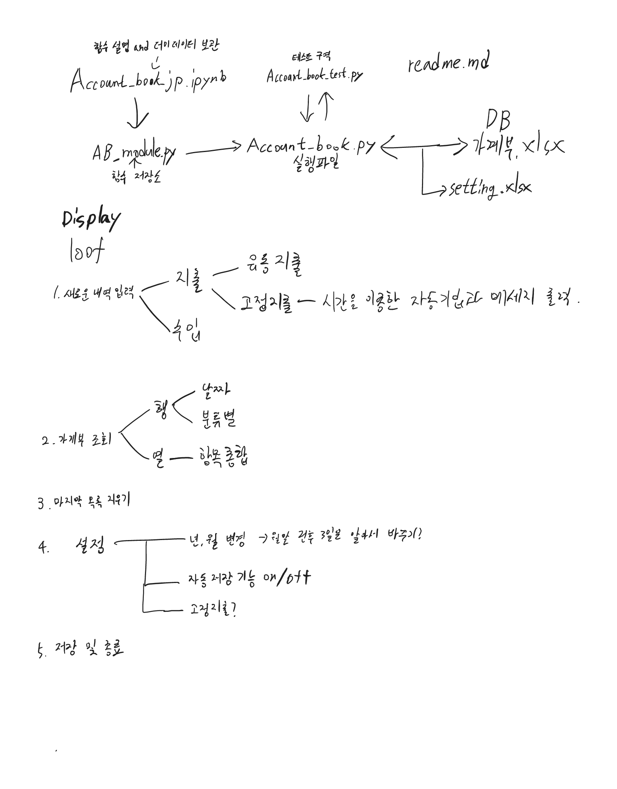

가계부 v0.14

## 엑셀, cvs 파일을 불러와 정보를 입력하고, 다시 파일로 저장해준다!

---

#### `account_book_module.py`에서 모든 함수를 불러오며, 고정값 및 세팅은 setting.xlsx에서 확인 가능
#### 이에 대한 자세한 설명은 `account_book_jp.ipynb`에 확인할 수 있음.

---

### 모식도




---

#### 


`0.15 버전`

**- 고정 항목은 따로 관리할 수 있도록 만들자! 0.14 구현**

 **ㄴ 이 부분에서 애를 많이 먹었는데, 함수안에서 파라미터로 받은 값을 함수 내에서 새 변수로 할당하면 그 값이 변하지 않는다... 반드시 할당이 필요하면 return으로 꺼내와서 밖에서 사용하자... 메모리를 어떻게 참조하고 있는지 생각해보자**
 
```python
result = [1,2,3]

def test(A):
    A[0] = 5

test(result)

print(result) # [5,2,3]

def test_2(A):
    A = A[0]

print(result) # [1,2,3]

```

---


#### 업데이트 로그

- ~~디스플레이 프린트를 완성하자!~~ 0.12 구현

- e~~sc나 탈출키를 입력하면 루프에서 완전 벗어날 수 있도록 해보자!~~ 0.12구현

- ~~입력마다 모든 사항이 자동 저장시키는 기능을 on/off 할 수 있게 만들어보자!~~ 0.13구현

- ~~수익과 지출의 세부 사항은 완전히 다르게 기록할 필요가 있을 것 같음.~~ 0.14 구현

- ~~자동 저장 설정을 자동 저장해주는 모듈 ㅋㅋㅋㅋㅋㅋㅋㅋㅋㅋㅋ~~ 0.14 구현

- *~~고정 항목은 따로 관리할 수 있도록 만들자! 0.14 부분 구현 - 수정 많이 필요~~* 0.15 구현

- 동백전 캐시백 데이터 올려보자

- 구독 모아보기 및 결제 일자 확인

- 데이터 암호화!

- 소비 리포트 출력해주기!

- 입력에서 None 값이 들어왔을 때 다른 걸 출력해주자!!


#### 항상 신경쓰기

- 어떤 함수는 Account_book.py 내의 global 변수를 인자로 들고 와서 발동 하고, 어떤 함수는 함수 내에서 직접 df랑 setting을 선언해서 바꾸는데, 통일할 필요가 있을듯!

- 가계부 조회기능 강화!

- 모든 상황에서도 오류로 인한 종료가 일어나지 않도록 신경쓰자!


### 최종 목표!?

- 딥러닝을 이용해 영수증 사진을 찍으면 알아서 분류해주는 기능!

#### 넣으면 좋을 기능

1. 한 번에 얼마나 썼는지

2. 저번 달과 비교

3. 목표 금액 다가오면 경고창

4. 얼마나 낭비했는지 (ex> 귤 한박스)

5. account_book_jp.ipynb 를 수정하면 module.py도 수정되면 좋겠다...


---

`0.11 버전`

**마지막 항목 삭제 기능 추가**

**최근 10개 항목 보기 추가**

`0.12 버전`

**3번 입력 실패시 루프 탈출 적용!**

**디스플레이 뼈대 완성**

`0.13 버전`

**설정 메뉴 제작**

**자동 저장 on/off 구현!**

**기본 연, 월 설정 수정 구현!**

**실행 파일에서의 데이터 삽입 메뉴 모듈화!**

**기타 오류 발생, 무한루프 구간 픽스!**


`0.14 버전`

**- 부분 부분 버그 픽스**

**- 수익과 지출의 세부 사항의 차별적 입력!**

**- 고정 지출/수익 항목은 따로 관리할 수 있도록 설정에 추가 - 지속 업데이트 예정**

**- 자동 설정의 설정을 자동으로 저장해줌**

